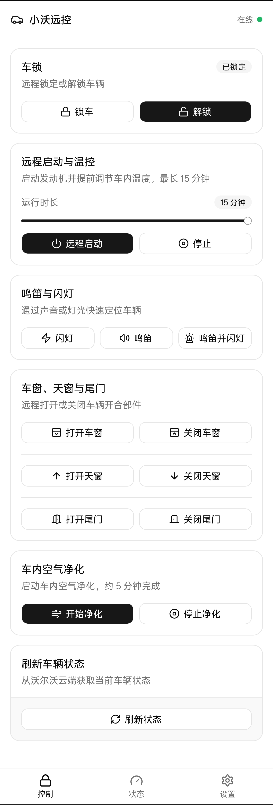
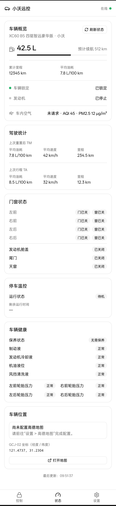
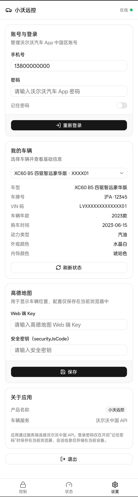

# 小沃远控

面向沃尔沃中国区 **SPA1 平台**（C3）的非官方 Web / PWA 远程控制客户端。浏览器不直连车辆，全部请求经 Node.js 服务端代理沃尔沃私有 REST + gRPC 接口。适用于燃油及插电混动车型，镜像约 97 MB。

## 免责声明

- 本项目与 **沃尔沃汽车（Volvo Cars）** 及其关联公司**无任何关系**，未获得其认可、授权或背书。
- 项目通过逆向工程分析沃尔沃私有通信协议，仅出于**学习与技术研究**目的。
- 使用者应**自行承担全部风险与责任**。远程控制指令会真实作用于车辆，误操作可能导致人身伤害或财产损失。
- 使用本项目可能违反沃尔沃的服务条款，**账号可能被限制或封禁**。
- 本项目**不提供任何形式的担保**，作者不对因使用本项目造成的任何损失承担责任。
- 请仅用于**自己合法拥有或已获授权**的车辆和账号。

## 截图

| 控制 | 状态 | 我的 |
|------|------|------|
|  |  |  |

## 快速体验

内置 demo 账号，无需真实车辆即可预览完整界面：

- 手机号：`13800000000`
- 密码：`demo`

演示数据为一台虚拟 XC60，所有控制操作模拟返回成功。

## 功能

**状态查看**
- 车辆概览：油量（按车型油箱容量换算比例）、续航里程、累计里程、平均油耗
- 门窗状态：四车门、发动机舱盖、油箱盖、尾门、天窗；四车窗支持**微开检测**
- 车辆健康：保养提醒（剩余天数 / 里程）、制动液、发动机冷却液、机油、风挡清洗液、低压电瓶、四轮胎压、外部灯光（制动 / 雾灯 / 远近光 / 日行 / 转向 / 牌照灯等）故障检测
- 实时位置（需配置高德地图）
- 车内空气质量（AQI / PM2.5）
- 驾驶统计：TM 累计与 TA 单次（里程 / 平均速度 / 平均油耗）
- 车辆基础信息：车牌、VIN、年款、动力类型、车身与内饰颜色

**远程控制**
- 锁车 / 解锁
- 远程启动 / 停止（联动空调，可选 1–15 分钟）
- 鸣笛 / 闪灯 / 鸣笛并闪灯
- 车窗 / 天窗 / 尾门 打开与关闭
- 车内空气净化 启动 / 停止
- 主动刷新车辆状态

所有控制操作均需**二次确认**，避免误触。状态更新采用**事件驱动**（进入页面 / 手动刷新 / 控制后自动更新），不做定时轮询，减少对车辆服务的请求量。

**会员与账户**
- 账户概览：头像、昵称、会员等级、V 值余额、成长值进度
- 每日签到
- 登录后即时拉取并缓存于本地

**能力感知**
- 后端依据 VIN 向沃尔沃能力接口查询车辆支持的远程功能
- 不支持的卡片在前端自动隐藏，能力未确认时按钮禁用

**其他**
- 深色模式
- PWA 可安装到桌面
- 多车辆切换
- 记住密码，会话失效自动静默重登，服务重启无感恢复
- 车门未锁提醒（解锁超过阈值后主动提示）
- 「我的」页：更新 PWA、配置高德地图 Key、查看数据最后拉取时间

## 技术栈

| 层 | 技术 |
|---|------|
| 前端 | React 19、TypeScript、Vite、Tailwind CSS v4、shadcn/ui (Radix)、vite-plugin-pwa、高德地图 |
| 服务端 | Node.js、Express 5、gRPC (@grpc/grpc-js)、TypeScript |
| 协议 | SPA1 C3 gRPC、DigitalVolvo REST（SDK-HMAC-SHA256 签名） |
| 部署 | 多阶段 Docker 镜像（alpine，约 97 MB） |

当前仅对接 SPA1 平台（沃尔沃中国区 C3）。SPA2 协议已通过官方 APK 反编译完成分析，但尚未接入。

## 项目结构

```text
.
├── web/                          React 前端与 PWA
│   └── src/
│       ├── components/           页面与 UI 组件
│       │   ├── control-tab.tsx   控制页
│       │   ├── status-tab.tsx    状态页
│       │   └── me-tab.tsx        我的（登录、车辆切换、地图配置）
│       ├── hooks/                React hooks（认证、车辆状态、账户会员）
│       └── lib/                  工具库（API 客户端、认证、地图）
├── server/                       Express API 服务端
│   └── src/
│       ├── index.ts              Express 路由（含 demo 账号、REST + gRPC 代理）
│       ├── session.ts            会话管理（持久化 + 自动恢复 + keepAlive + 并发去重）
│       ├── session-store.ts      会话磁盘持久化
│       └── volvo/
│           ├── base.ts           DigitalVolvo REST 客户端（鉴权、账号、会员、签到）
│           ├── grpc.ts           SPA1 gRPC 客户端（10 个状态查询 + InvocationService 控制）
│           ├── signing.ts        SDK-HMAC-SHA256 签名
│           ├── vehicle.ts        车辆状态聚合 + 控制指令 + 油箱容量表
│           ├── capabilities.ts   能力查询 / 缓存 / 守卫
│           ├── engine-status.ts  远程启动状态解析
│           ├── unlock-reminder.ts 车门未锁提醒状态机
│           ├── settings-store.ts 用户设置按账号持久化
│           ├── client-profile.ts 版本与 Header 集中配置
│           ├── log.ts            统一日志
│           └── demo.ts           Demo 数据
├── demo/
│   ├── run.sh                    本地开发脚本（start/stop/restart/rebuild/status/logs）
│   └── data/                     运行时数据（PID、日志、会话、设置）
├── docs/
│   └── pictures/                 应用截图
└── Dockerfile                    多阶段生产镜像
```

## 部署

### 方式一：源码运行

```bash
git clone https://github.com/melosbot/xiaowo-remote.git
cd xiaowo-remote

cd server && npm ci && cd ../web && npm ci
cd ../web && npm run build

cd ../server
npm start
```

打开 <http://localhost:8787>。如需高德地图，构建前复制 `web/.env.example` 为 `web/.env.local` 填入 Key。

### 方式二：Docker 构建

```bash
git clone https://github.com/melosbot/xiaowo-remote.git
cd xiaowo-remote

docker build -t xiaowo-remote \
  --build-arg VITE_AMAP_KEY=你的Key \
  --build-arg VITE_AMAP_SECURITY_JS_CODE=你的安全密钥 \
  .
mkdir -p ./volvo-data && chmod 777 ./volvo-data
docker run -d -p 8787:8787 -v "$(pwd)/volvo-data:/app/data" xiaowo-remote
```

地图参数可省略。挂载前需 `mkdir -p ./volvo-data && chmod 777 ./volvo-data` 确保容器内 node 用户可写。

### 方式三：拉取预构建镜像

```bash
docker pull ghcr.io/melosbot/xiaowo-remote:main
mkdir -p ./volvo-data && chmod 777 ./volvo-data
docker run -d -p 8787:8787 -v "$(pwd)/volvo-data:/app/data" ghcr.io/melosbot/xiaowo-remote:main
```

镜像由 GitHub Actions 自动构建，支持 linux/amd64 与 linux/arm64。

---

## 开发

```bash
cd server && npm ci && cd ../web && npm ci

# 一键启动
./demo/run.sh start           # 安装依赖 → 构建前端 → 启动服务 → 前台运行

# 其他命令
./demo/run.sh restart         # 重启服务（不重建前端）
./demo/run.sh rebuild         # 重装依赖 + 重建前端 + 重启
./demo/run.sh stop            # 停止服务
./demo/run.sh status          # 查看服务状态
./demo/run.sh logs            # 查看最近 40 行日志

# 或手动分端开发
cd server && npm run dev      # API → :8787
cd web && npm run dev         # 前端 → :5173，自动代理 API
```

## 环境变量

### 前端

| 变量 | 默认值 | 说明 |
|------|--------|------|
| `VITE_API_BASE` | 空 | API 基础地址，同源部署无需设置 |
| `VITE_AMAP_KEY` | 空 | 高德地图 Web 端 JS API Key |
| `VITE_AMAP_SECURITY_JS_CODE` | 空 | 高德地图安全密钥 |

### 服务端

| 变量 | 默认值 | 说明 |
|------|--------|------|
| `HOST` | `0.0.0.0` | 监听地址 |
| `PORT` | `8787` | 监听端口 |
| `WEB_ROOT` | `web/dist` | 前端静态文件目录 |
| `DATA_DIR` | `./data` | 会话、设置持久化目录 |

## 检查

```bash
cd web
npm run lint && npm run typecheck && npm run build

cd ../server
npm run typecheck
```

## 安全架构

### 凭证隔离

```
浏览器                           服务端                           Volvo
  │                                │                                │
  │── phone + password ───────────→│  （仅登录时传一次）              │
  │                                │── HMAC 签名 ─────────────────→│
  │←── sessionId ─────────────────│←── accessToken / xToken ──────│
  │                                │   （存入内存，永不下发）         │
  │                                │                                │
  │── /api/...?session=xxx ───────→│                                │
  │                                │── Bearer token ───────────────→│
  │←── 车辆数据 ───────────────────│←── gRPC 响应 ──────────────────│
```

- 服务端**从不将 Volvo 凭证下发到浏览器**，浏览器仅持有无意义的 `sessionId`
- 会话持久化至磁盘（`DATA_DIR/sessions.json`），服务重启后自动恢复，无需重新登录
- token 刷新带并发去重锁，避免重复登录触发服务端限流；5 分钟 keepAlive 保活
- 客户端自动检测会话失效并利用「记住密码」凭据静默重登，用户无感知
- 浏览器持久化会话与最近车辆状态（localStorage）；启用「记住密码」后凭据也存入本地——**请勿在公共或他人设备上启用该选项**
- 服务端可代发任意控制指令，**不应直接暴露到公网**

### 部署建议

公网部署前至少应增加：HTTPS、身份认证、CORS 白名单、速率限制、反向代理隔离。

### 远程控制

- 所有控制操作均需**二次确认**方可发送
- 状态更新采用**事件驱动**（首次进入 / 手动刷新 / 控制后），不进行定时轮询
- 指令会真实作用于车辆，发送前请确认周围环境安全

## 已知限制

- 仅对接 SPA1 / C3 平台，SPA2 车辆（新款纯电 / EX 系列、`hf_` 前缀 VIN）暂不支持。
- 油箱容量按车型规格表静态映射，部分车型可能未覆盖。
- 功能可用性取决于车型配置、车机软件版本、账号权限与网络状态。
- 沃尔沃私有接口可能随官方 App 更新而变化，届时状态读取或控制功能可能暂时失效。
- 停车温控单独控制当前不可用；SPA1 燃油车通过远程启动联动空调。

## 致谢

- 协议实现参考了 [hass-volvooncall-cn](https://github.com/idreamshen/hass-volvooncall-cn)，感谢 [@idreamshen](https://github.com/idreamshen) 的逆向工作，省了不少摸索。
- 感谢 [LinuxDo](https://linux.do) 社区里一起折腾沃尔沃控车的朋友们，讨论和反馈帮了大忙。
- 感谢提供车型数据、提 issue 的车主们。

觉得有用的话，顺手给上面两个项目点个 Star。
